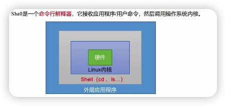

# shell编程

 

### sehll 环境相关

##### bash和zsh的位置：

ls /bin/bash  ls /bin/zsh

bash与zsh都是mac终端自带的shell命令解释器，早期macos系统默认使用bash解释器，在macos10.15系统中官方推荐使用zsh解释器。



##### shell环境

`cat /etc/shells`   查看所有shell环境

`echo $SHELL`   查看当前shell环境

` env`  SHELL=/bin/zsh  当前所有的全局环境变量

`set` 当前所有的全局和局部环境变量

##### 切换shell环境
因为zsh功能更强大，一般不做切换  

```cpp
chsh -s /bin/zsh
chsh -s /bin/bash

bash 的环境变量是.bash_profile文件。
zsh 的环境变量是.zshrc文件。

PS：如果从 bash 切换到 zsh，但想保留 bash 所设置的环境变量，可在 .zshrc文件末尾添加 source ~/.bash_profile 保存退出，并重启终端即可使用 bash 的环境变量。
```


### 简单回顾终端命令

##### 文件

man 获取帮助信息   man cd

pwd 显示当前工作目录的绝对路径

mkdir 创建一个文件夹

rmdir 删除一个==空的==文件夹

touch 创建一个文件

cp 复制一个文件或目录

rm 删除文件

mv 移动文件和目录

cat 打开一个文件

echo 输出一个字符串

##### 权限

ls -l 或者 ll 看文件详情，可以看到文件权限  rwx  读·写·执行

chmod u+x hello.sh  更改权限   有+ - = 三种

##### 搜索查找

find 查找某个文件或者目录

find shell/ -name ".png"         find shell/ -name info         

grep 选项（-n）查找内容 源文件             搜索文件内   -n 显示行号

find ./ -name "*md" | grep -n tools

##### 压缩

gzip/gunzip 

1. 只能压缩文件不能压缩目录 
2. 不保留源文件
3. 同时压缩多个会出现多个压缩包

```
$ ls
hello.sh zip.sh

$ gzip hello.sh zip.sh 

$ ls
hello.sh.gz zip.sh.gz

$ gunzip hello.sh.gz zip.sh.gz  

$ ls
hello.sh zip.sh
```


zip/unzip 

可以压缩多个文件和目录

zip (-r 压缩目录) XXX.zip           unzip (-d 解压到哪里) XXX.zip

zip bb.zip hello.sh zip.sh       unzip bb.zip 


tar打包

tar 选项 

c:产生.tar打包文件

v:显示详细信息

f:制定压缩后的文件名

z:打包同时压缩

x:解压.tar文件

C:解压到指定目录

压缩： tar -zcvf aaa.tar.gz hello.sh zip.sh    // aaa.tar.gz 压缩包名字

解压： tar -zxvf aaa.tar.gz   或者   tar -zxvf aaa.tar.gz -C ./aaa


### shell 语法

#### 基本语法

1. 定义变量:   变量名=变量值   =="="前后不能有空格==

2. 计算：   

   ```
   $ a=$[1+5]    //a=$((1+5))
   $ echo $a    
   6
   ```

3. 入参：@1 - @9  //@0为当前name
   ```
   //sh文件
   echo "您输入的："
   echo file_name  $0
   echo 1: $1
   echo 2: $2
   
   //调用
   $ sh hello.sh 111 222
   您输入的：
   file_name hello.sh
   1: 111
   2: 222

4. $# 获取所有的参数的个数 上面 `$#` 为2

5. $* 所有参数，所有参数为一个整体    

   $@ 所有参数，参数区别对待

   $? 上一个语句输出的结果

   

#### 条件判断

1.  test 和 []   `test $a -eq 6`   `[ $a = 6 ]`   用$?打印结果

2. 常用判断条件

   -eq:等于  -lt:小于   -gt:大于  -ne:不等于  -le:小于等于  -ge:大于等于

   `test $a -eq 6`

   -r:读的权限  -w:写的权限  -x:执行的权限  -e:存在  -f:存在，并且是文件  -d:存在，并且是文件夹

   `[ -f hello.sh ]`

   &&:表示上一个命令执行成功，才执行后一条命令    ||:表示上一个命令失败，才执行后一条命令

   三目：   `[ -d hello.sh ] && echo cunzai || echo nocunzai`


#### 流程控制

##### if

if [ 条件表达式 ]

then

​	程序

elif [ 条件表达式 ]

then

​	程序

else

​	程序

fi

```shell
if [ $1 -eq 5 ]
then
        echo is 5
elif [ $1 -eq 6 ]
then
        echo is 6
else
        echo no 5,6
fi
```

##### case

```shell
case $1 in
1)
		echo "is 1"
;;
2)
		echo "is 2"
;;
*)
		echo "is other"
;;
esac
```


##### for

``` shell
sum=0
for ((i=0;i<100;i++))
do
	sum=$[$sum+$i]
done
```

##### for in
```shell
a=0
for i in "$*"
do
        a=$[$a+1]
        echo "1:$a" $i
done

b=0
for j in "$@"
do
        b=$[$b+1]
        echo "2:$b" $j
done


结果：  如果不用 “”  两个没任何区别
$ sh hello.sh a b c
1:1 a b c
2:1 a
2:2 b
2:3 c
```

##### while

while [ 条件判断 ]

do

​	程序

done

#### read
read (选项) (参数)
选项：-p 提示符    -t 等待时间(秒）
变量：取值变量名

``` shell
read -p 哈哈哈 -t 5 a
echo $a
```


#### 系统方法
basename 获取当前执行的文件名字

dirname 获取文件的路径 （非绝对路径，主要还是看执行的时候 传的是什么）

``` shell
echo name: $(basename $0).sh
cd $(dirname $0)
echo path:$(pwd)

for i in $@
do
        echo 参数：$i
done
```


#### 自定义方法

``` shell
function add(){
        a=$[$1 + $2]
        echo $a
}

read -p "第一个数：" a
read -p “第二个数：" b
sum=$(add $a $b)
echo $sum
```


> crontab 系统定时任务
>
> crontab -l 查看当前的定时任务
>
> crontab -e 编辑添加任务

> **参数**:
>
> -e [UserName]: 执行文字[编辑器](https://baike.baidu.com/item/编辑器?fromModule=lemma_inlink)来设定时程表，内定的文字编辑器是 VI，如果你想用别的文字编辑器，则请先设定 VISUAL 环境变数来指定使用那个文字编辑器(比如说 setenv VISUAL joe)
>
> -r [UserName]: 删除目前的时程表
>
> -l [UserName]: 列出目前的时程表
>
> -v [UserName]:列出用户cron作业的状态
>
> **时程表的格式如下**:
>
> f1 f2 f3 f4 f5 program
>
> 其中 f1 是表示分钟，f2 表示小时，f3 表示一个月份中的第几日，f4 表示月份，f5 表示一个星期中的第几天。program 表示要执行的程式。
>
> 当 f1 为 * 时表示每分钟都要执行 program，f2 为 * 时表示每小时都要执行程式，其余类推
>
> 当 f1 为 a-b 时表示从第 a 分钟到第 b 分钟这段时间内要执行，f2 为 a-b 时表示从第 a 到第 b 小时都要执行，其余类推
>
> 当 f1 为 */n 时表示每 n 分钟个时间间隔执行一次，f2 为 */n 表示每 n 小时个时间间隔执行一次，其余类推
>
> 当 f1 为 a, b, c,... 时表示第 a, b, c,... 分钟要执行，f2 为 a, b, c,... 时表示第 a, b, c...个小时要执行，其余类推


### 正则表达式入门

例子：abcdefg

常规匹配： cd

头 ^: ^a

尾 $: `$g` 

任意字符 .:  a..d

任意个数 *:  `a.*g`

区间 [] : [a,b] a和b  [a-z] a到z  [0-9]* 任意长度的数字字符串  [0-9,a-d]

\ 转义符： `'\$'`


### 文本处理工具

使用到的时候在学一下 

==cut==

==awk==


