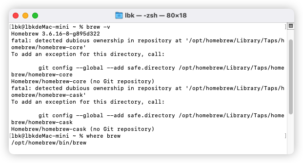

# 终端那些事


## 命令

### 隐藏和显示隐藏文件夹

> 显示隐藏路径的终端命令:defaults write com.apple.finder AppleShowAllFiles -boolean true ; killall Finder
>
> 取消隐藏路径的终端命令:defaults write com.apple.finder AppleShowAllFiles -boolean false ; killall Finder

### 目录操作

| 命令名 | 功能描述             | 使用举例         |
| ------ | -------------------- | ---------------- |
| mkdir  | 创建一个目录         | mkdir dirname    |
| rmdir  | 删除一个目录         | rmdir dirname    |
| mvdir  | 移动或重命名一个目录 | mvdir dir1 dir2  |
| cd     | 改变当前目录         | cd dirname       |
| pwd    | 显示当前目录的路径名 | pwd              |
| ls     | 显示当前目录的内容   | ls -la           |
| dircmp | 比较两个目录的内容   | dircmp dir1 dir2 |

### 文件操作

| 命令名 | 功能描述               | 使用举例                  |
| ------ | ---------------------- | ------------------------- |
| cat    | 显示或连接文件         | cat filename              |
| pg     | 分页格式化显示文件内容 | pg filename               |
| more   | 分屏显示文件内容       | more filename             |
| od     | 显示非文本文件的内容   | od -c filename            |
| cp     | 复制文件或目录         | cp file1 file2            |
| rm     | 删除文件或目录         | rm filename               |
| mv     | 改变文件名或所在目录   | mv file1 file2            |
| ln     | 联接文件               | ln -s file1 file2         |
| find   | 使用匹配表达式查找文件 | find . -name "*.c" -print |
| file   | 显示文件类型           | file filename             |
| open   | 使用默认的程序打开文件 | open filename             |

### 选择操作

| 命令名 | 功能描述                       | 使用举例                     |
| ------ | ------------------------------ | ---------------------------- |
| head   | 显示文件的最初几行             | head -20 filename            |
| tail   | 显示文件的最后几行             | tail -15 filename            |
| cut    | 显示文件每行中的某些域         | cut -f1,7 -d: /etc/passwd    |
| colrm  | 从标准输入中删除若干列         | colrm 8 20 file2             |
| paste  | 横向连接文件                   | paste file1 file2            |
| diff   | 比较并显示两个文件的差异       | diff file1 file2             |
| sed    | 非交互方式流编辑器             | sed "s/red/green/g" filename |
| grep   | 在文件中按模式查找             | grep "^[a-zA-Z]" filename    |
| awk    | 在文件中查找并处理模式         | awk '{print $1 $1}' filename |
| sort   | 排序或归并文件                 | sort -d -f -u file1          |
| uniq   | 去掉文件中的重复行             | uniq file1 file2             |
| comm   | 显示两有序文件的公共和非公共行 | comm file1 file2             |
| wc     | 统计文件的字符数、词数和行数   | wc filename                  |
| nl     | 给文件加上行号                 | nl file1 >file2              |

### 安全操作

| 命令名 | 功能描述               | 使用举例                |
| ------ | ---------------------- | ----------------------- |
| passwd | 修改用户密码           | passwd                  |
| chmod  | 改变文件或目录的权限   | chmod ug+x filename     |
| umask  | 定义创建文件的权限掩码 | umask 027               |
| chown  | 改变文件或目录的属主   | chown newowner filename |
| chgrp  | 改变文件或目录的所属组 | chgrp staff filename    |
| xlock  | 给终端上锁             | xlock -remote           |

### 编程操作

| 命令名 | 功能描述                 | 使用举例                   |
| ------ | ------------------------ | -------------------------- |
| make   | 维护可执行程序的最新版本 | make                       |
| touch  | 更新文件的访问和修改时间 | touch -m 05202400 filename |
| dbx    | 命令行界面调试工具       | dbx a.out                  |
| xde    | 图形用户界面调试工具     | xde a.out                  |

### 进程操作

| 命令名 | 功能描述               | 使用举例         |
| ------ | ---------------------- | ---------------- |
| ps     | 显示进程当前状态       | ps u             |
| kill   | 终止进程               | kill -9 30142    |
| nice   | 改变待执行命令的优先级 | nice cc -c *.c   |
| renice | 改变已运行进程的优先级 | renice +20 32768 |

### 时间操作

| 命令名 | 功能描述                 | 使用举例   |
| ------ | ------------------------ | ---------- |
| date   | 显示系统的当前日期和时间 | date       |
| cal    | 显示日历                 | cal 8 1996 |
| time   | 统计程序的执行时间       | time a.out |

### 网络与通信操作

| 命令名 | 功能描述                          | 使用举例                    |
| ------ | --------------------------------- | --------------------------- |
| telnet | 远程登录                          | telnet hpc.sp.net.edu.cn    |
| rlogin | 远程登录                          | rlogin hostname -l username |
| rsh    | 在远程主机执行指定命令            | rsh f01n03 date             |
| ftp    | 在本地主机与远程主机之间传输文件  | ftp ftp.sp.net.edu.cn       |
| rcp    | 在本地主机与远程主机 之间复制文件 | rcp file1 host1:file2       |
| ping   | 给一个网络主机发送 回应请求       | ping hpc.sp.net.edu.cn      |
| mail   | 阅读和发送电子邮件                | mail                        |
| write  | 给另一用户发送报文                | write username pts/1        |
| mesg   | 允许或拒绝接收报文                | mesg n                      |

### Korn Shell 命令

| 命令名  | 功能描述                        | 使用举例        |
| ------- | ------------------------------- | --------------- |
| history | 列出最近执行过的 几条命令及编号 | history         |
| r       | 重复执行最近执行过的 某条命令   | r -2            |
| alias   | 给某个命令定义别名              | alias del=rm -i |
| unalias | 取消对某个别名的定义            | unalias del     |

### 其它命令

| 命令名 | 功能描述                       | 使用举例     |
| ------ | ------------------------------ | ------------ |
| uname  | 显示操作系统的有关信息         | uname -a     |
| clear  | 清除屏幕或窗口内容             | clear        |
| env    | 显示当前所有设置过的环境变量   | env          |
| who    | 列出当前登录的所有用户         | who          |
| whoami | 显示当前正进行操作的用户名     | whoami       |
| tty    | 显示终端或伪终端的名称         | tty          |
| stty   | 显示或重置控制键定义           | stty -a      |
| du     | 查询磁盘使用情况               | du -k subdir |
| df     | 显示文件系统的总空间和可用空间 | df /tmp      |
| w      | 显示当前系统活动的总信息       | w            |


## VI/VIM

### vi/vim 的使用

​	VI/VIM 是系统自带的一种文字编辑器

​	基本上 `vi/vim` 共分为三种模式，分别是命令模式（`Command mode`），插入模式（`Insert mode`）和底线命令模式（`Last line mode`）

​	

用户刚刚启动 `vi/vim`，便进入了命令模式。

##### 命令模式 -> 输入模式  i
##### 命令模式 -> 底线命令模式  :
##### 输入模式/底线命令模式 -> 命令模式  ESC


### vi/vim 使用实例

- 使用 `vi` 来建立名为 `test.txt` 的文件

```css
    vi test.txt
```

- 按下 `ESC`按钮回到一般模式
- 在一般模式中按下 `:wq`储存后离开 `vi`

### vi/vim 按键说明

- 一般模式下

|         按键          |                             效果                             |
| :-------------------: | :----------------------------------------------------------: |
|  h 或 向左箭头键(←)   |                     光标向左移动一个字符                     |
|  j 或 向下箭头键(↓)   |                     光标向下移动一个字符                     |
|  k 或 向上箭头键(↑)   |                     光标向上移动一个字符                     |
|  l 或 向右箭头键(→)   |                     光标向右移动一个字符                     |
|         备注          | 如果你将右手放在键盘上的话，你会发现 hjkl 是排列在一起的，因此可以使用这四个按钮来移动光标。 如果想要进行多次移动的话，例如向下移动 30 行，可以使用 "30j" 或 "30↓" 的组合按键， 亦即加上想要进行的次数(数字)后，按下动作即可！ |
| Ctrl + f 屏幕『向下』 |               移动一页，相当于 [Page Down]按键               |
| Ctrl + b 屏幕『向上』 |               移动一页，相当于 [Page Up] 按键                |
|   0 或功能键[Home]    |         这是数字『 0 』：移动到这一行的最前面字符处          |
|    $ 或功能键[End]    |                  移动到这一行的最后面字符处                  |
|           G           |                   移动到这个档案的最后一行                   |
|          gg           |                    移动到这个档案的第一行                    |
|       n<Enter>        |                 n 为数字。光标向下移动 n 行                  |
|         /word         | 向光标之下寻找一个名称为 word 的字符串。例如要在档案内搜寻 vbird 这个字符串，就输入 /vbird 即可 |
|           n           |                     重复前一个搜寻的动作                     |
|           N           |                  『反向』进行前一个搜寻动作                  |
| :n1,n2s/word1/word2/g | n1 与 n2 为数字。在第 n1 与 n2 行之间寻找 word1 这个字符串，并将该字符串取代为 word2 |
| :n1,$s/word1/word2/g  | 从第一行到最后一行寻找 word1 字符串，并将该字符串取代为 word2 |
| :n1,$s/word1/word2/gc | 从第一行到最后一行寻找 word1 字符串，并将该字符串取代为 word2 ！且在取代前显示提示字符给用户确认 (confirm) 是否需要取代 |
|           x           |                       向后删除一个字符                       |
|           X           |                       向前删除一个字符                       |
|          dd           |                    删除游标所在的那一整行                    |
|          ndd          |   n 为数字。删除光标所在的向下 n 行(包括游标所在的那一行)    |
|          yy           |                     复制游标所在的那一行                     |
|          nyy          |              n 为数字。复制光标所在的向下 n 行               |
|           p           |               为将已复制的数据在光标下一行贴上               |
|           P           |               为将已复制的数据在光标上一行贴上               |
|           u           |                     复原前一个动作(撤销)                     |
|       Ctrl + r        |                        重做上一个动作                        |
|           .           |                        重复前一个动作                        |

- 一般模式切换到编辑模式

| 按键 |                    效果                     |
| :--: | :-----------------------------------------: |
|  i   |            从目前光标所在处插入             |
|  I   |   在目前所在行的第一个非空格符处开始插入    |
|  a   |    从目前光标所在的下一个字符处开始插入     |
|  A   |    从光标所在行的最后一个字符处开始插入     |
|  o   |    在目前光标所在的下一行处插入新的一行     |
|  O   |    在目前光标所在处的上一行插入新的一行     |
|  r   |      只会取代光标所在的那一个字符一次       |
|  R   | 会一直取代光标所在的文字，直到按下 ESC 为止 |

- 一般模式切换到指令行模式

|   按键    |                        效果                        |
| :-------: | :------------------------------------------------: |
|    :w     |             将编辑的数据写入硬盘档案中             |
|    :w!    |           强制将编辑的数据写入硬盘档案中           |
|    :q     |                        离开                        |
|    :q!    |                为强制离开不储存档案                |
|    :wq    |                     储存后离开                     |
|   :wq!    |                   强制储存后离开                   |
|  :set nu  | 显示行号，设定之后，会在每一行的前缀显示该行的行号 |
| :set nonu |                      取消行号                      |


## HomeBrew

##### 简介

Homebrew是一款Mac OS平台下的软件包管理工具，拥有安装、卸载、更新、查看、搜索等很多实用的功能。

官方地址：https://brew.sh/

官方安装命令： /bin/bash -c "$(curl -fsSL https://raw.githubusercontent.com/Homebrew/install/HEAD/install.sh)" 

但是说是因为该项目的git网址被污染了，不止科学上网的问题。可以尝试浏览器打开 https://raw.githubusercontent.com/Homebrew/ 应该是打不开


##### 安装

国内镜像： 终端命令

/bin/zsh -c "$(curl -fsSL https://gitee.com/cunkai/HomebrewCN/raw/master/Homebrew.sh)"

初始安装后，执行brew -v 可能出现一下错误



按照提示，执行一下命令。在config中添加两个命令即可。

git config --global --add safe.directory /opt/homebrew/Library/Taps/homebrew/homebrew-core

git config --global --add safe.directory /opt/homebrew/Library/Taps/homebrew/homebrew-cask


##### 基本命令

brew的安装位置	==命令： where brew==        //  /opt/homebrew/bin/brew

brew安装的软件位置 ==命令： brew list 项目名==

```cpp
// 查询：
brew search 软件名

// 安装：
brew install 软件名

// 卸载：
brew uninstall 软件名

// 更新 Homebrew：
brew update 

// 查看 Homebrew 配置信息：
brew config 

// brew的版本  
brew -v

//brew安装所有的软件
brew list
```


## bash、zsh、oh-my-zsh


#### mac自带bash，zsh位置

ls /bin/bash  ls /bin/zsh

bash与zsh都是mac终端自带的shell命令解释器，早期macos系统默认使用bash解释器，在macos10.15系统中官方推荐使用zsh解释器。

zsh原称为Z Shell。也是一种shell，兼容最常用的bash这种shell的命令和操作，并且有很多增强，超强的订制性。

zsh功能很强大，但是配置超难，oh-my-zsh工具简化了zsh的配置过程，oh-my-zsh 帮我们整理了一些常用的zsh 扩展功能和主题，[github地址](https://link.juejin.cn?target=https%3A%2F%2Fgithub.com%2Frobbyrussell%2Foh-my-zsh)


#### 安装oh-my-zsh


```
//确认zsh是否安装
zsh --version

// 官方方法
sh -c "$(curl -fsSL https://raw.github.com/robbyrussell/oh-my-zsh/master/tools/install.sh)"
//报错
curl: (7) Failed to connect to raw.githubusercontent.com port 443 after 10 ms: Connection refused

//国内镜像
sh -c "$(curl -fsSL https://gitee.com/mirrors/oh-my-zsh/raw/master/tools/install.sh)"
//安装位置为 用户 根目录下  .oh-my-zsh文件夹  ~/.oh-my-zsh

```

##### 设置主题

打开 ~/.zshrc文件  vim或者文字编辑都可以

默认 ZSH_THEME="robbyrussell"

ZSH_THEME="ys"  //ys为主题名字 ohmyzsh自带很多主题


#### 常用插件

__自动提示插件__

git clone git://github.com/zsh-users/zsh-autosuggestions $ZSH_CUSTOM/plugins/zsh-autosuggestions
使用： alt + -> 为单个词确认，直接 -> 为全部确认 

__语法高亮插件__
git clone git://github.com/zsh-users/zsh-syntax-highlighting $ZSH_CUSTOM/plugins/zsh-syntax-highlighting

__extract__ 用于解压任何压缩文件，不必根据压缩文件的后缀名来记忆压缩软件；
使用： x xxx.zip


#### 安装插件

打开 ~/.zshrc文件  vim或者文字编辑都可以
搜索 plugins  添加插件名字

```
plugins=(
    git
    z
    web-search
    extract
    zsh-autosuggestions
    zsh-syntax-highlighting
)
```


